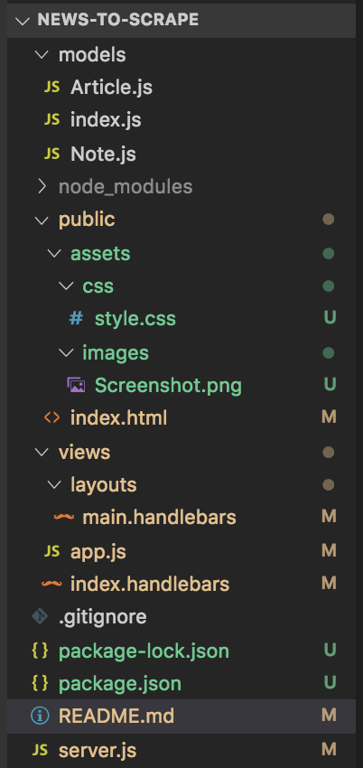

# News-to-Scrape: HackerNews.com


## Summary:
'news-to-scrape' is an application that would scrape all articles from Hacker News so that I, and other avid tech junkies, could stay connected to newest news within the computer hacking industry! By using the technologies of: mongoose, MongoDB, Node.js, and various other technologies to scrape Hacker News' articles via https://news.ycombinator.com, store the articles through a MongoDB database, and append the stored information values to 'news-to-scrape' where you, the user are just one click away in getting all tech hacking related news!

## Demo link:
https://salty-taiga-01960.herokuapp.com/

## File Structure:


## Getting Started:
The simpliest way in seeing a demo of 'news-to-scrape' is to click on the Heroku demo link right above that leads it directly to the project without any installations required. This link can be found within this readme file or at the description area within https://github.com/duongsters/news-to-scrape

To connect locally...
1) Clone 'news-to-scrape' repository via https://github.com/duongsters/news-to-scrape
2) Run command line Terminal (or via Gitbash) 'npm install' for required NPMs used within the application ('npm i express express-handlebars axios cheerio mongoose morgan')...or just download all NPMs from Technologies Used below.
3) Run command line 'node server.js' to start up the application
4) Once connected to http://localhost:8080/ from CLI, copy that exact link to URL
5) Run 'ctrl + c' within the CLI to exit 'news-to-scrape' entirely


## Technologies Used:
- HTML
- CSS
- Javascript
- jQuery
- Node.js
- MongoDB
- NPM: Express, Mongoose, Morgan, Express-Handlebars, Axios, Cheerio, Heroku

## Code Snippets:
via server.js:
* This code snippet shows the route for scraping all New Articles into application. Using axios, we grab the the body of hacker news' body of articles and searches and grabs every class named 'title' within an table data tag then places empty result object into 'result' variable and adds the News Hacker article title and save it's as properties of the result object. Evenutally, it will send a message to the user when the function is successfully ran to scrape Hacker News' articles
```javascript
app.get("/scrape", function (req, res) {
    axios.get("https://news.ycombinator.com/").then(function (response) {
        var $ = cheerio.load(response.data);

        $("td.title").each(function (i, element) {
            var result = {};

            result.title = $(this)
                .children("a")
                .text();
            result.link = $(this)
                .children("a")
                .attr("href");


            db.Article.create(result)
                .then(function (dbArticle) {
                    console.log(dbArticle);
                })
                .catch(function (err) {
                    console.log(err);
                });
        });
        res.send("Hacker News's articles Scrape Complete");
    });
});
```
via app.js:
* The on-click events handlers from my app.js file shows how the 'news-to-scrape" works in saving the user's notes to the specific Hacker News article by use of using the ajax GET method in getting the user's customized notes while sotring it in the mongo db and ajax POST method fetching the data from the mongo db and posting it on 'news-to-scrape' webpage
```javascript
$(document).on("click", "p", function () {
    $("#notes").empty();
    var thisId = $(this).attr("data-id");
    $.ajax({
        method: "GET",
        url: "/articles/" + thisId
    })
        .then(function (data) {
            console.log(data);
            $("#notes").append("<h2>" + data.title + "</h2>");
            $("#notes").append("<input id='titleinput' name='title' >");
            $("#notes").append("<textarea id='bodyinput' name='body'></textarea>");
            $("#notes").append("<button data-id='" + data._id + "' id='savenote'>Save Now</button>");

            if (data.note) {
                $("#titleinput").val(data.note.title);
                $("#bodyinput").val(data.note.body);
            }
        });
});

$(document).on("click", "#savenote", function () {
    var thisId = $(this).attr("data-id");
    $.ajax({
        method: "POST",
        url: "/articles/" + thisId,
        data: {
            title: $("#titleinput").val(),
            body: $("#bodyinput").val()
        }
    })
        .then(function (data) {
            console.log(data);
            $("#notes").empty();
        });
    $("#titleinput").val("");
    $("#bodyinput").val("");
});
```


## Author Links:
- [GitHub](https://github.com/duongsters) ||
 [LinkIn](https://www.linkedin.com/in/theandrewduong/) ||
 [Portfolio](https://www.duongsters.github.io/updated-portfolio/)
